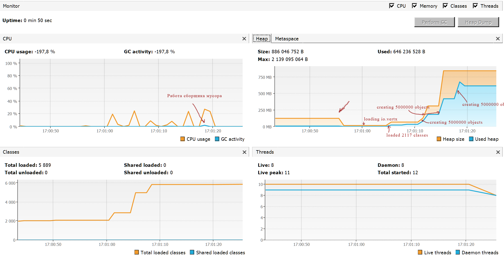

Домашнее задание для Netology.ru для курса Java Developer   

Описание и инструкция к выполнению [здесь](https://github.com/netology-code/jd-homeworks/tree/master/jvm/README.md)

События происходили в следующем поядке:

-	17:01:01.077744100: loading io.vertx
-	17:01:01.448765300: loaded 529 classes
-	17:01:04.454937300: loading io.netty
-	17:01:05.147976900: loaded 2117 classes
-	17:01:08.148148500: loading org.springframework
-	17:01:08.365160900: loaded 869 classes
-	17:01:11.365332500: now see heap
-	17:01:11.365332500: creating 5000000 objects
-	17:01:11.680350600: created
-	17:01:14.681522200: creating 5000000 objects
-	17:01:14.906535100: created
-	17:01:17.957709600: creating 5000000 objects
-	17:01:18.264727200: created

На графике № 1 отображаются пики загруженности процессора при запусках создания объктов, так же виден момент срабатывания сборщика мусора.
На графике №2 Синхронно с графиком №1 т.е. с созданием объектов, происходит увеличение размера памяти под heap.
